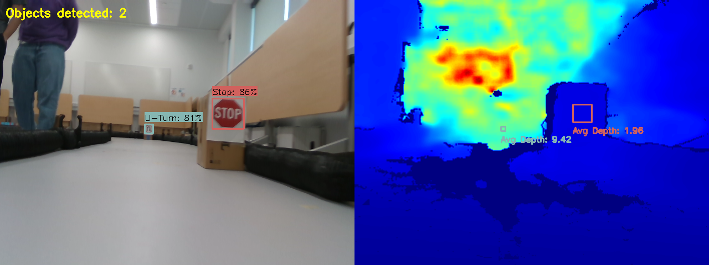
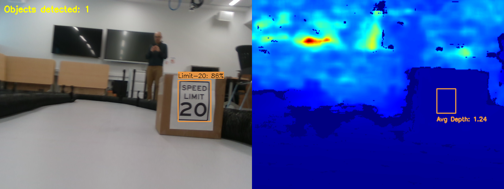
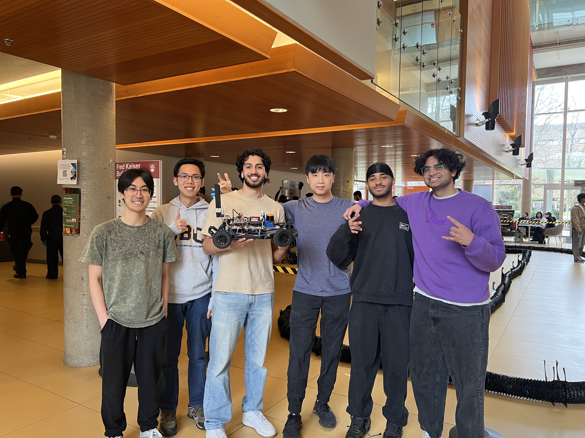

# RoboRacer: Autonomous Driving with Reactive Control and Sign Detection

## 🚗 Overview

Welcome to the GitHub repository for **Team A3 Redbull**'s **RoboRacer**, an autonomous F1TENTH vehicle designed to perform real-time reactive driving and respond intelligently to traffic signs. This project was developed as part of the University of British Columbia's CPEN 391 course, combining ROS2, LiDAR and camera-based perception, and a custom-trained YOLO11s model deployed on an NVIDIA Jetson platform.

> 🏁 Our team had the **fastest car in the class** and **won the 1v1 final race** in Milestone 5.

Demo links:
- [Traffic Sign Detection Demo](https://drive.google.com/file/d/1ON4MIbLQRqVeuOMO0PTJuRHBbdv6Jmkv/view?usp=drive_link)
- [1v1 Race](https://drive.google.com/file/d/1PsJ3z321DLkNnLvyQT0SMqT40Vll2nzC/view?usp=drive_link)
- [Milestone 1 Demo](https://youtu.be/yvtDp_aCy8s?si=DxsPLZQGtSKTc_XD)
- [Milestone 2 Demo](https://drive.google.com/file/d/1jrV1ZiG6ObPj7nbUWfK-hTsTJaT1flKH/view?usp=drive_link)
- [Milestone 3 Demo](https://drive.google.com/file/d/1br11WN8YTonKmsYsux1AFI0WClTyiFCr/view?usp=drive_link)

---

## 📚 Table of Contents

- [About F1TENTH](#about-f1tenth)
- [Repository Structure](#repository-structure)
- [Milestones](#milestones)
- [Project: Vision-Based Traffic Sign Detection](#project-vision-based-traffic-sign-detection)
- [Setup and Usage](#setup-and-usage)
- [Future Work](#future-work)

---

## 📖 About F1TENTH

F1TENTH is a research and education platform for 1/10th scale autonomous vehicles. It provides a ROS2-based interface and simulator to develop, test, and deploy real-time driving algorithms. Learn more: [F1TENTH Coursekit Docs](https://f1tenth-coursekit.readthedocs.io/en/latest/index.html)

---

## 🗂 Repository Structure

This repository contains 6 main ROS2 packages:

```
.
├── milestone1/       # Reactive driving in simulation using wall-following
├── milestone2/       # On-car reactive driving using LiDAR and gap following
├── milestone3/       # Vision-based depth steering and lane following
├── milestone4/       # High-speed on-car driving with dynamic obstacle handling and safety
├── milestone5/       # Final race logic (optimized from milestone4, no lap count, tuned speed/safety)
├── project/          # Traffic sign detection and action execution using YOLO and Jetson acceleration
```

---

## 📌 Milestones

### Milestone 1: Reactive Driving in Simulation
- Implemented wall-following using LiDAR and PID control.
- Introduced basic obstacle detection and emergency stop.
- More details in the [Milestone 1 README](milestone1/README.md).

### Milestone 2: On-Car LiDAR-Based Driving
- Switched to a **gap-following algorithm** for better obstacle handling.
- Dynamically adjusted speed based on turn sharpness and front clearance.
- More details in the [Milestone 2 README](milestone2/README.md).


### Milestone 3: Vision-Based Depth Driving
- Implemented **depth-based steering** using Realsense camera.
- Lane detection pipeline was explored but proved less reliable than depth.
- Included emergency braking and lap detection via image comparison.
- More details in the [Milestone 3 README](milestone3/README.md).


### Milestone 4: Speed, Safety, and Robust Navigation
- Combined LiDAR gap-following with dynamic speed control and smarter obstacle avoidance.
- Created a safety-stop mechanism using historical gap data.
- Implemented lap counting using visual reference image matching.
- This milestone contains the final competition-ready code: `milestone4/scripts/auto_drive_node_fast.py`
- More details in the [Milestone 4 README](milestone4/README.md).

### Milestone 5: 1 vs 1 Racing (🏆 Winner!)
- Built on milestone 4 with small race-focused changes:
  - Removed lap-count logic.
  - Optimized speed and turning for overtaking and tighter controls.
  - Adjusted safety stop behavior to slow (not halt) when near another car.
- Final race code: `milestone5/scripts/auto_drive_node_fast.py`
- More details in the [Milestone 5 README](milestone5/README.md).

---

## 🧠 Project: Vision-Based Traffic Sign Detection

This standalone ROS2 package enables the car to:
- Detect traffic signs using a custom YOLO11s model.
- React to detected signs with real-time maneuvers:
  - **STOP** – Full stop with a 3-second pause.
  - **YIELD** – Reduced speed.
  - **U-TURN** – Executes a multi-stage turning sequence.
  - **Speed Limits (20/100)** – Dynamically adjusts driving speed.

### Architecture Highlights
- Jetson-optimized pipeline with GPU inference using Ultralytics + ONNX.
- Depth estimation to determine sign proximity.
- Cooldown timers to prevent repeated triggering.




More details in the [Project README](project/README.md) and [Presentation PDF](Vision_Based_Navigation.pdf).

---

## ⚙️ Setup and Usage

Each package has a detailed README with build and run instructions.

### Common Workflow
```bash
# From your ROS2 workspace root
colcon build --packages-select <milestone or project>
source install/local_setup.bash
```

### Running Milestone Code (e.g., for race):
```bash
ros2 run milestone5 auto_drive_node_fast.py --ros-args -p num_laps:-1
```

### Running Sign Detection:
```bash
LD_PRELOAD=/usr/lib/aarch64-linux-gnu/libgomp.so.1 python3 object_detection_node.py
python3 auto_drive_node.py
```

---

## 🙌 Acknowledgments

- Team A3 Redbull: Abhi Verma, Ayden Bauyon, Jason Hsu, Matthew Fung, Noah Ndambuki, Armaan Braich
- CPEN 391, University of British Columbia
- F1TENTH and Jetson development community


---