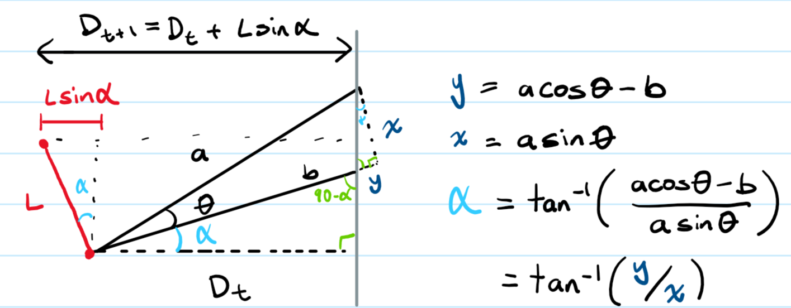

# Milestone 1: Team A3 Redbull

## Demo
[Video Link](https://youtu.be/yvtDp_aCy8s?si=DxsPLZQGtSKTc_XD)

## Contents

* [Wall Following Algorithm](#wall-following-algorithm)
* [Avoiding Collisions](#avoiding-collisions)
* [Testing Methodology](#testing-methodology)

## Wall Following Algorithm

Our algorithm is based off of the slides from the [F1Tenth Website](https://roboracer.ai/learn.html) and the wall following skeleton code.

There are two goals for the car at this stage:

1. Maintain some desired distance from the left-wall
2. Drive parallel to the left-wall

To implement these goals, we need to know the car's current distance from the wall so that we can calculate the error. To do this, we take two range measurements from the LiDAR, one at 45 degrees and one at 90 degrees. These range values are $a$ and $b$ in the diagram below, respectively.

We can use these values to calculate $\alpha$, which allows us to calculate the current distance from the wall:

$$\alpha = \arctan\Big(\frac{a \cos{(\theta)} - b}{a \sin{(\theta)}}\Big)$$

To adjust for delays and the lack of an instantaneous response, we calculate error based on the difference between an estimate of the future distance of the car, $D_{t+1}$, and the desired distance from the wall, $L$:

$$D_t = b \cos{(\alpha)}$$
$$D_{t+1} = D_t + L \sin{(\alpha)}$$

The error is then given by $L - D_{t+1}$. A positive error indicates that the car is closer to the wall it is following, and a negative error indicates that the car is further from the wall it is following.

The PID control also sets the speed based on the magnitude of the error; slow down for larger errors, and speed up for smaller errors. Also, we stop the car and don't allow the PID control to move it if the car is blocked to avoid the collision logic and wall following logic from competing with each other.

## Avoiding Collisions

We modified the [automatic braking](https://gsathish.craft.me/fbbVKR9waqscQa) code to avoid collisions. However this time, we don't set the steering angle to zero so that now the car can still steer while stopping.

## Testing Methodology

For our PID constant values, we initally tried numbers around $1.5$, and speeds no greater than $2.5m/s$. With these values, the car did a decent job getting around Spielberg.

However when we increased the driving speeds, the car did substantially worse and would oscillate and crash into the walls. This was caused by $k_p$ being too large or by $k_d$ being too small. So we found the smallest $k_p$ that allowed the car to make clean turns until it started oscillating/overshooting, then adjusted $k_d$ until it was damped nicely. There is still more tuning we could do for this, especially for the physical car. Also, we didn't find $k_i$ to be as helpful so we set it to zero.

The wall following algorithm worked well for the smooth turns on Spielberg, but failed on the sharp turns on Levine. If we are following the right wall, and there is a sharp turn to the left, then the car will crash. What we trying to do now is implement some gap following algorithm which will direct the car better if it is "blocked". Another thing we could implement is following *both* walls somehow.

Lastly, we test the implementation using Python, then translate it into C++ when we are satisfied. This is handy as Python is generally easier to write, and we can just run the new script instead of rebuilding. Also, we have not seen much performance differences between the Python and C++ implementations so far.
