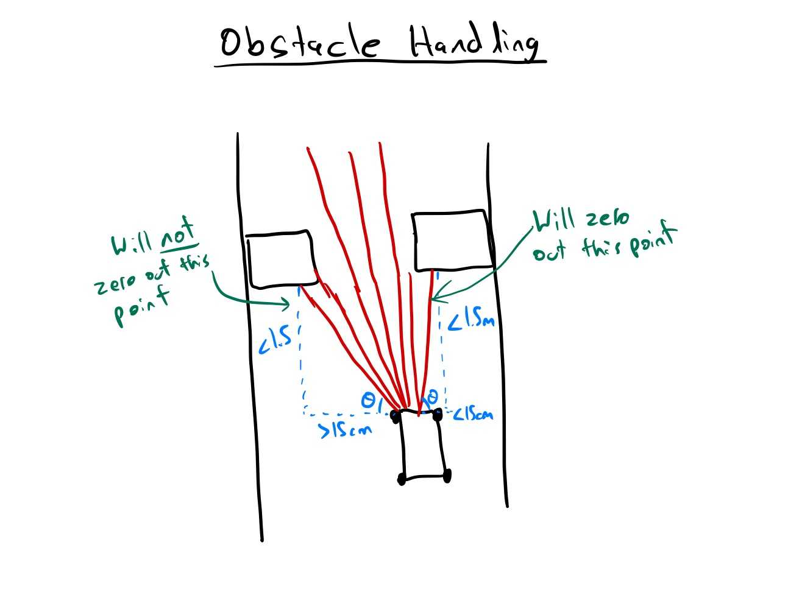
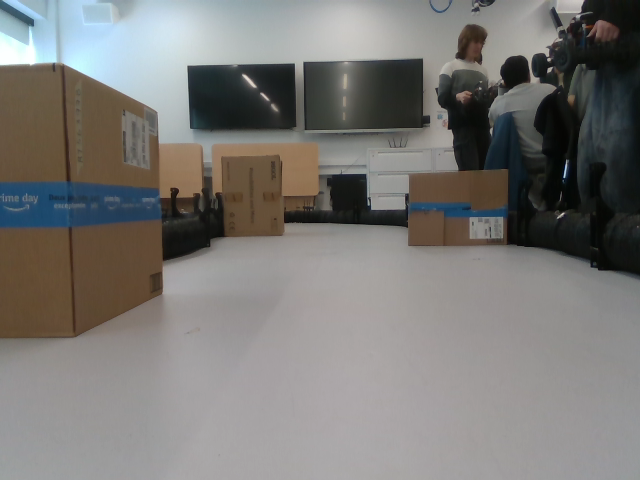
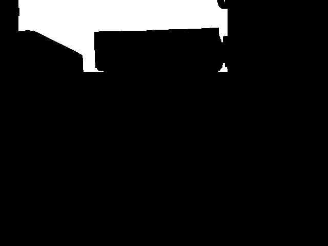
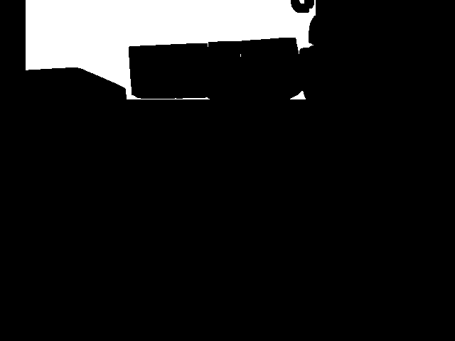

# Milestone 4: On-Car Reactive Driving with Speed, Obstacle Handling, and Safety

## Contents

- [Algorithms](#algorithms)
- [Testing Strategies](#testing-strategies)
- [Improvements over Previous Milestones](#improvements-over-previous-milestones)
- [Usage](#usage)
- [Final Thoughts](#final-thoughts)

## Algorithms

For Milestone 4, we focused on optimizing the vehicle’s speed, obstacle handling, and had a big emphgasis on safety. Our implementation is built on a combination of LIDAR-based gap-following, camera-based lap detection, adaptive speed control, and an **improved and tested safety stop** mechanism. The final algorithm that we used for the milestone 4 evaluation can be found in `milestone4/scripts/auto_drive_node_fast.py`. Other files such as `auto_drive_node.py` and `auto_drive_node_slow.py` were only used for testing purposes.

### Speed and Turning Angle Optimization

- Improved the `get_speed` function to use an exponential speed adjustment based on the car’s proximity to obstacles on low turning angles.
- Increased the base speed and other speeds compared to Milestone 3 while ensuring smoother acceleration and deceleration to prevent jerky movements.
- Heavily tested and adjusted PID tuning in `pid_control` function to balance aggressive speed control with stability.

### Obstacle Handling

- Introduced a moving history of gap distances to make more intelligent path selection decisions, preventing sudden, unnecessary direction changes.
- In `preprocess_lidar_scan`, calculated horizontal distance of every LIDAR point and if distance is within 15cm (half of width of car) and LIDAR distance is measured to be less than 1.5m then zero out the point (similar idea to `draw_safety_bubble` function). This allows for faster object detection for objects that in front of the car ensures the car will not drive towards them.
- Added more angle processesing after PID controller in `pid_control` function to make car drive smoother on straights and take sharper turns when detecting obstacles.
- Improved `draw_safety_bubble` by adjusting the safety radius based on the car’s speed, ensuring safer navigation in high-speed scenarios.
- Heavily tested the car’s ability to anticipate dynamic obstacles and smoothly re-route while maintaining a reasonable speed.

  <figure style="display: inline-block;">
    
    <figcaption style="margin-top: 10px; margin-bottom: 20px">Figure 1.0: Added obstacle handling in preprocess_lidar_scan function</figcaption>
  </figure>

### Enhanced Safety Mechanisms

- Created `new_safety_stop` function, which finds the average of distances in the gap found by `find_max_gap` over the last 20 gaps and stops if this average is less than the safety stop threshold. This ensures the car stops if there is no path to be taken. It also finds average width of the gap and if this width is less than a threshold, the car will also stop, ensuring the car does not attempt to navigate through overly narrow gaps.
- The safety stop threshold is changed dynamically based on the car's average speed over the last 10 speeds.
- Used `safety_stop` as a backup to stop the car if any LIDAR scans right in front of the car are less than 0.3m.

### Lap Counting
- Implemented a lap-counting algorithm in `image_callback` to ensure automatic stoppage after specified parameter of laps.
- The algorithm takes an image when the node first starts and processes this image, which includes converting to grayscale, cropping, masking, applying binary thresholding, and using morphological closing to fill white spots, to use as a reference image.
- On subsequent images after reference image, the algorithm processes and compares them to the reference image to detect laps.
- There is also a timeout after an image has been matched so multiple images on the same part of the track are not matched at once.
- Allows for dynamic lap detection.

  <figure style="margin: 10px; text-align: center;">
    
    <figcaption style="margin-top: 10px; margin-bottom: 20px">Figure 2.1: Reference image</figcaption>
  </figure>
  <figure style="margin: 10px; text-align: center;">
    
    <figcaption style="margin-top: 10px; margin-bottom: 20px">Figure 2.2: Processed reference image</figcaption>
  </figure>
  <figure style="margin: 10px; text-align: center;">
    
    <figcaption style="margin-top: 10px; margin-bottom: 20px">Figure 2.3: Processed matched image</figcaption>
  </figure>

## Testing Strategies

### Speed and Turning Angle Testing

- Conducted multiple 7-lap trials using various PID configurations to fine-tune acceleration, braking, and stability.
- Compared the updated `get_speed` function against the Milestone 3 implementation, observing a roughly **25% improvement** in average lap speed while maintaining control and safety.
- Evaluated the interaction between the new speed control and turning angle logic to ensure the vehicle maintained smooth navigation without overcorrection at high speeds.

### Obstacle Handling Testing

- Positioned static obstacles at key points on the track to evaluate trajectory adaptation and compare behavior with Milestone 3.
- Introduced dynamic (moving) obstacles to assess system responsiveness, measuring the detection-to-reaction time.
- Verified smoother path selection through historical gap analysis, reducing sudden changes in direction.

### Safety Testing

- Rigorously tested emergency stop scenarios using varied obstacle types and placements to ensure activation only under necessary conditions.
- Assessed the performance of the history-based filtering in `new_safety_stop`, which reduced false positives by almost **80%** compared to Milestone 3.

### Lap Count Testing

- Validated the robustness of the lap-counting system with various starting points, resulting in different reference images, to ensure consistent race behavior.

## Improvements Over Previous Milestones

1. **Higher Speed with Enhanced Stability**
   - Upgraded `get_speed` to allow for a higher base speed while preserving vehicle control.
   - Fine-tuned acceleration and braking curves for smoother transitions during speed changes.

2. **Advanced Obstacle Avoidance**
   - Refined path selection to eliminate erratic turns and unnecessary maneuvers.
   - Improved `draw_safety_bubble` to scale more effectively with speed, enhancing obstacle detection in fast-paced situations.
   - Increased accuracy in detecting and responding to dynamic obstacles using both LIDAR and gap history data.

3. **Robust Safety Enhancements**
   - Improved emergency stop logic to act only when required, reducing unintended halts.
   - Introduced a history-based filtering mechanism in safety stop routines to better distinguish real threats from noise.
   - Strengthened lap recognition and image processing for improved reliability and race tracking.

4. **Optimized System Performance**
   - Reduced latency in LIDAR and camera processing when using C++, enabling faster real-time decision-making.
   - Enhanced perception algorithms for both lane and obstacle detection, improving responsiveness in complex track scenarios.

## Usage

To set this up on the car or simulator, do this once:

- `cd` into the workspace where this repo is under the `/src` directory.
- Run `colcon build --packages-select milestone4`.
- Run `source install/local_setup.bash`.

If running in the simulator:

- Make sure you've properly installed and set up the simulator.
- In one terminal session, run `ros2 launch f1tenth_gym_ros gym_bridge_launch.py`.
<!-- - In another terminal session, run `ros2 run milestone4 auto_drive_node`. -->
- In another terminal session, run `ros2 run milestone4 auto_drive_node_fast.py`.

If running on the car:

- In a terminal, either
   <!-- - (a) run the node (going 7 laps) using the launch file by executing `ros2 launch milestone4 milestone4_cpp.py` -->
   - (a) run the node (going 7 laps by default) using the launch file by executing `ros2 launch milestone4 milestone4_py.py`
   <!-- - or (b) run the node by executing `ros2 run milestone4 auto_drive_node --ros-args -p num_laps:YOUR_VALUE_HERE -p USING_SIM:=false` where `YOUR_VALUE_HERE` is the amount of laps you want the car to run (set it to -1 if you would like it to lap indefinitely). -->
   - or (b) run the node by executing `ros2 run milestone4 auto_drive_node_fast.py --ros-args -p num_laps:YOUR_VALUE_HERE` where `YOUR_VALUE_HERE` is the amount of laps you want the car to run (set it to -1 if you would like it to lap indefinitely).

## Final Thoughts

Overall, we are content with the results. We managed to come back from the setbacks of milestone 3 and came back with a car that is capable of higher speeds, navigating through more difficult obstacles, and stop safely in time when an emergency occurs. 

The most major change was switching our navigation algorithm to purely LiDAR-based. This ensured more reliable obstacle distance data compared to working with depth images in milestone 3.

The theme of most implementations was to make it more "dynamic", meaning making components more adapatable to factors like current speed and distance to the closest obstacle and making fine adjustments accordingly. This allowed for maxium performance while ensuring the car didn't make adjustments too abruptly. This concept, coupled with persistent parameter tuning and testing allowed us to achieve the results we desired. 
